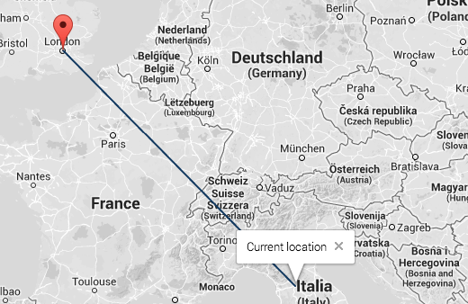

                                                                     
                                                                     
                                                                     
                                             
# Geodesic distance

This simple web app compute the geodesic distance between the user current location
and White Bear Yard, 144a Clerkenwell Road, EC1R 5DF, London using the Vincenty inverse problem formula.

## Formula
>The distance between two points in Euclidean space is the length of a straight line between them, 
>but on the sphere there are no straight lines. In non-Euclidean geometry, straight lines are replaced with geodesics. 
>Geodesics on the sphere are the great circles (circles on the sphere whose centers coincide with the center of the sphere).


Where d is the distance between the two given point and r is the earth radius.


where
 
and 
 
 are the geographical latitude and longitude of two points 1 and 2 and 
 
their absolute differences.

References:
* [As the crow flies][1]
* [Earth radius][2]
* [Great circles distance][3]
* [Vincenty formulae][4]

## Technologies Used

* Python
* Flask
* Requests
* Jquery
* Json
* HTML5/Css
* Javascript
* Bootstrap
* Perfect-scrollbar
* Google maps API

## Setup
Make sure your web browser supports geolocation and install Python, Flask, Requests in your environment following the official guides: 

* [http://www.python.org][5]
* [http://flask.pocoo.org/docs/installation/#installation][6]
* [http://docs.python-requests.org/en/latest/user/install/#install][7]

I also recommend to use virtualenv to create a wrapper for the project. I used [these][9] instructions.

Once downloaded the Geodesic distance project make sure the server settings (host, port, debug)
in the geodesicDistance.py file and the `url` variable
in the getDistance function contained in the index.html file are configured in the same way.

## Content

The project consists in a Python web service which, responding to an http request, gives back the distance between the two given points in km.

Methods:
```Python
def geodesicDistance(point1, point2Lat, point2Lng):
```
Using the Vincenty formula it calcolates the distance between point1 and point2. 
```Python
def getDistance(lat,lng):
```
Passing to the geodesicDistance function the given address and the latitude and longitude of the current location, it gives back the distance between point1 and point2 in km.
```Python
def parseQ(args):
```
It takes a query and parse it.
```Python
def createResponse(code, message, distance):
```
It creates a response with the given parameters to give back to the Html page.
The javascript code call a GET method to the url where the .py file is running passing to it the current location latitude and longitude.
```Javascript
   function getDistance(position) {
     url = 'http://127.0.0.1:5000/geodesicDistance';
     query = position.coords.latitude.toString()+','+position.coords.longitude.toString();
     $.get(url, {'q': query},function(data) {
     $('#results .distance')[0].innerHTML = Math.round(data['result']['distance']*1000)/1000;
     })
   }
```                     
The .py file running at the above url parse the query received and gives a response:
``` Python
response = createResponse('Response code', 'Status of the query', 'Distance between the two points')
```
The Html page takes it back and with a `.innerHTML` statement change the distance with the correct one.

For the Html/css code I used a Bootstrap theme adapted to my needs. In particular I edited the `initialize_map()`
function which initialize the map showing two markers: one at the given position and one at the user current position linking them 
with a polyline.



## Local deployment
Open a terminal window and move to the project folder, then type 
``` Bash
python geodesicDistance.py
``` 
and press enter.
Open another terminal window, and in the same project directory type
``` Bash
python -m SimpleHTTPServer
```
Using a browser wich support the geolocation API, navigate to `http://127.0.0.1:8000`
where `127.0.0.1:8000` are the associated url and port where the web server is running. 


## Remote deployment
Follow the Heroku deployment guide to remotely deploy this project
https://devcenter.heroku.com/articles/python

Before the deployment follow these steps to make it work:
* Create a `templates` folder and move inside it the `index.html` file
* Create a `static` folder and move inside it the `css`, `js`, `less` folders 
* Edit the geodesicDistance.py file and uncomment `def renderIndex():` to make Heroku render the index.html page in the templates folder you've created.
* Change `app.run(debug=debug, host=host, port=port)` to `app.run(debug=debug)` so the app can bind to an Heroku random port
* Edit the `index.html` file: at line 63 change the assignment to the `url` variable to `'/geodesicDistance'`.  
  At the first lines of the file edit the `<link>` and `<script>` lines to make this page point to the correct path. 
  Eg. : `<link rel="stylesheet" href="css/themes/default/bootstrap.css" type="text/css">` will become 
  `<link rel="stylesheet" href="/static/css/themes/default/bootstrap.css" type="text/css">`

This app is deployed here: [http://geodesicdistance.herokuapp.com/][10]. 
It may takes a short delay for the first request because this Heroku app has only one web dyno and if it doesn't receive any traffic in 1 hour, it goes to sleep.

[1]: http://en.wikipedia.org/wiki/As_the_crow_flies
[2]: http://en.wikipedia.org/wiki/Earth_radius
[3]: http://en.wikipedia.org/wiki/Great-circle_distance
[4]: http://en.wikipedia.org/wiki/Vincenty%27s_formulae
[5]: http://www.python.org
[6]: http://flask.pocoo.org/docs/installation/#installation
[7]: http://docs.python-requests.org/en/latest/user/install/#install
[8]: https://developers.google.com/maps/documentation/geocoding/
[9]: http://www.silverwareconsulting.com/index.cfm/2012/7/24/Getting-Started-with-virtualenv-and-virtualenvwrapper-in-Python
[10]: http://geodesicdistance.herokuapp.com/
